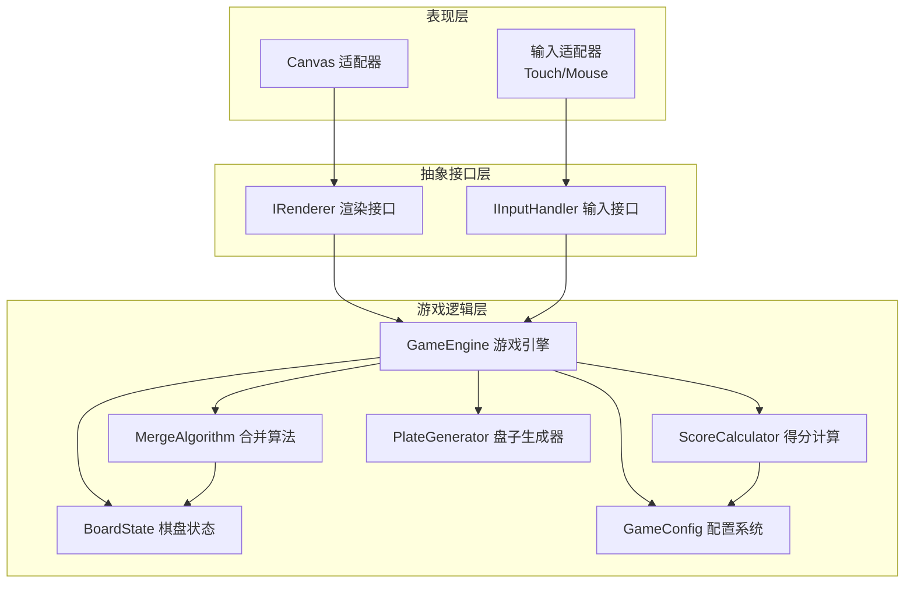
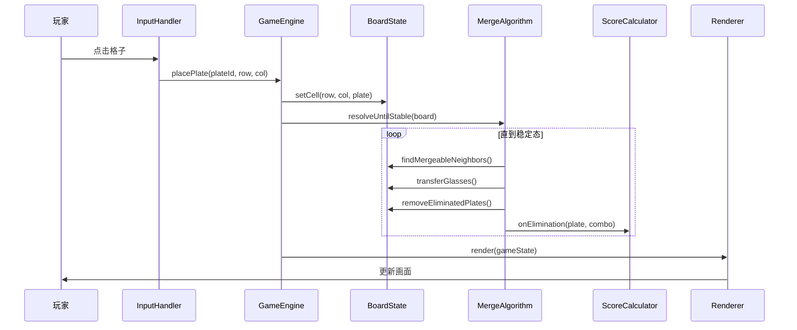
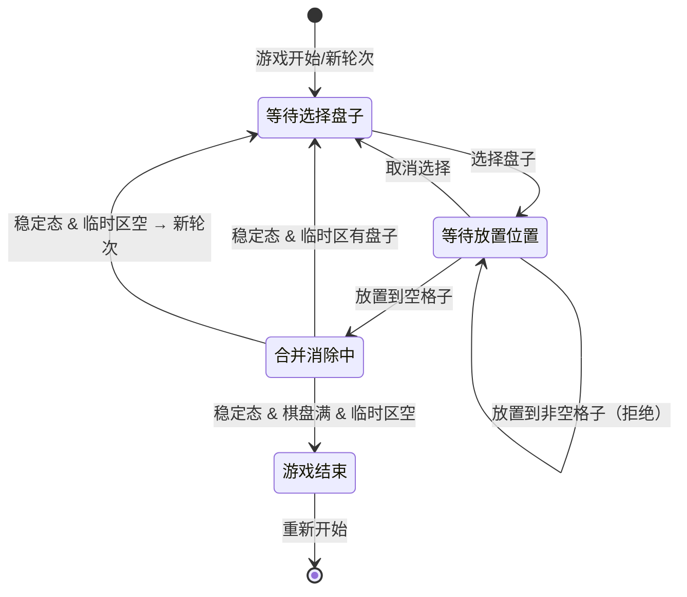

# 技术设计文档：心动的生活 - 消除类游戏

## 概述

本设计文档描述「心动的生活」消除类游戏的技术架构与实现方案。游戏核心是一个 6×4 网格棋盘，玩家将带有酒杯的盘子放置到格子中，通过相邻盘子间同类型酒杯的合并与消除来获得分数。

技术栈选择：
- 语言：TypeScript（严格模式）
- 渲染：HTML5 Canvas（通过抽象渲染接口）
- 打包：Vite + Capacitor（Web + iOS/Android）
- 测试：Vitest + fast-check（属性测试）

关键设计决策：
1. 游戏逻辑层与渲染层彻底分离，逻辑层零平台依赖
2. 渲染层通过抽象接口定义，当前仅实现 Canvas 适配器
3. 所有游戏参数通过 Config 系统集中管理，支持运行时覆盖
4. 合并算法采用迭代收敛策略，每次放置后循环执行合并+消除直到稳定态

## 架构

### 整体分层



### 数据流




## 组件与接口

### 1. GameConfig（配置系统）

负责管理所有可配置参数，提供默认值和校验逻辑。

```typescript
interface GameConfig {
  boardRows: number;          // 棋盘行数，默认 6
  boardCols: number;          // 棋盘列数，默认 4
  glassTypeCount: number;     // 酒杯种类数量，默认 8
  minGlassesPerPlate: number; // 新盘子最少酒杯数，默认 1
  maxGlassesPerPlate: number; // 新盘子最多酒杯数，默认 4
  slotsPerPlate: number;      // 每个盘子的槽位数，固定 6
  platesPerRound: number;     // 每轮发放盘子数，固定 3
  targetGlassCount: number;   // 目标酒杯数量 m，默认 2
  targetGlassRefreshThreshold: number; // 目标酒杯刷新阈值，默认 10
  roundBonuses: RoundBonus[]; // 单轮额外奖励配置
}

interface RoundBonus {
  threshold: number;  // 满盘消除数阈值
  bonus: number;      // 奖励分数
}
```

校验规则：
- `minGlassesPerPlate <= maxGlassesPerPlate`
- `boardRows >= 1 && boardCols >= 1`
- `glassTypeCount >= 1`
- `targetGlassCount <= glassTypeCount`
- 不合法时回退默认值并 `console.warn`

### 2. GameEngine（游戏引擎）

游戏的核心控制器，协调所有子系统。

```typescript
interface IGameEngine {
  // 生命周期
  start(): void;
  reset(): void;

  // 玩家操作
  selectPlate(index: number): void;
  placePlate(row: number, col: number): PlacementResult;

  // 状态查询
  getState(): GameState;
  isGameOver(): boolean;
}

interface GameState {
  board: BoardState;
  stagingArea: (Plate | null)[];
  score: number;
  combo: number;
  round: number;
  roundEliminations: number;
  targetGlasses: GlassType[];
  totalFullEliminations: number;
  selectedPlateIndex: number | null;
  gameOver: boolean;
}

interface PlacementResult {
  success: boolean;
  mergeSteps: MergeStep[];
  eliminations: EliminationEvent[];
  scoreGained: number;
  comboCount: number;
  roundBonuses: number;
}
```

### 3. BoardState（棋盘状态）

纯数据结构，表示棋盘当前状态。

```typescript
interface IBoardState {
  getCell(row: number, col: number): Cell;
  setCell(row: number, col: number, plate: Plate | null): void;
  isEmpty(row: number, col: number): boolean;
  getNeighbors(row: number, col: number): CellPosition[];
  hasEmptyCell(): boolean;
  clone(): IBoardState;
}

type Cell = Plate | null;

interface CellPosition {
  row: number;
  col: number;
}
```

### 4. MergeAlgorithm（合并算法）

核心算法模块，负责合并与消除的迭代收敛。

```typescript
interface IMergeAlgorithm {
  resolveUntilStable(board: IBoardState): ResolutionResult;
}

interface ResolutionResult {
  mergeSteps: MergeStep[];
  eliminations: EliminationEvent[];
  isStable: boolean;
}

interface MergeStep {
  sourcePos: CellPosition;
  targetPos: CellPosition;
  glassType: GlassType;
  count: number;
}

interface EliminationEvent {
  position: CellPosition;
  plate: Plate;
  reason: 'full_same_type' | 'empty';
}
```

合并算法流程：
1. 扫描所有相邻盘子对，找出存在同类型酒杯的对
2. 对每对，将同类型酒杯转移到时间戳更早的盘子（不超过6个上限）
3. 检查是否有盘子满足消除条件（空盘或6个同类型）
4. 执行消除
5. 若发生了任何变化，回到步骤1；否则达到稳定态

### 5. ScoreCalculator（得分计算）

```typescript
interface IScoreCalculator {
  calculateEliminationScore(
    event: EliminationEvent,
    comboIndex: number,
    targetGlasses: GlassType[]
  ): number;

  calculateRoundBonus(
    roundEliminations: number,
    config: GameConfig
  ): number;
}
```

得分规则：
- 空盘消除：0 分
- 满盘消除（第 N 个 combo）：N 分
- 目标酒杯加成：得分 × 2
- 单轮额外奖励：按配置阈值累加

### 6. PlateGenerator（盘子生成器）

```typescript
interface IPlateGenerator {
  generatePlates(count: number): Plate[];
}
```

依赖 `GameConfig` 中的酒杯种类数和数量范围，使用注入的随机数生成器以支持测试确定性。

### 7. IRenderer（渲染抽象接口）

```typescript
interface IRenderer {
  // 初始化
  init(container: HTMLElement): void;
  destroy(): void;

  // 渲染
  renderState(state: GameState): void;

  // 动画
  animateMerge(steps: MergeStep[]): Promise<void>;
  animateElimination(events: EliminationEvent[]): Promise<void>;
  animateScoreChange(oldScore: number, newScore: number): Promise<void>;

  // 布局
  resize(): void;
}
```

### 8. IInputHandler（输入抽象接口）

```typescript
interface IInputHandler {
  init(element: HTMLElement): void;
  destroy(): void;
  onCellClick(callback: (row: number, col: number) => void): void;
  onStagingClick(callback: (index: number) => void): void;
}
```

### 9. CanvasRenderer（Canvas 适配器）

实现 `IRenderer` 接口，使用 HTML5 Canvas 2D API 绘制游戏画面。

关键职责：
- 根据屏幕尺寸计算格子大小和布局
- 绘制棋盘网格、盘子、酒杯
- 实现合并/消除动画
- 显示分数、combo、目标酒杯等 UI 元素
- 监听 `resize` 事件自适应


## 数据模型

### 核心实体

```typescript
// 酒杯类型（用数字表示，0 到 glassTypeCount-1）
type GlassType = number;

// 盘子
interface Plate {
  id: string;                    // 唯一标识
  glasses: GlassType[];          // 当前酒杯列表（长度 0~6）
  placedTimestamp: number | null; // 放置时间戳，null 表示尚未放置
}

// 棋盘
interface Board {
  rows: number;
  cols: number;
  cells: (Plate | null)[][];     // rows × cols 二维数组
}

// 游戏完整状态
interface GameState {
  board: Board;
  stagingArea: (Plate | null)[];  // 长度为 3
  score: number;
  combo: number;                  // 当前 move 的 combo 计数
  round: number;                  // 当前轮次
  roundEliminations: number;      // 当前轮满盘消除计数
  targetGlasses: GlassType[];    // 当前目标酒杯类型列表
  totalFullEliminations: number;  // 累计满盘消除数（用于目标酒杯刷新）
  selectedPlateIndex: number | null; // 当前选中的临时区盘子索引
  gameOver: boolean;
}
```

### 状态转换



### 配置默认值

| 参数 | 默认值 | 说明 |
|------|--------|------|
| boardRows | 6 | 棋盘行数 |
| boardCols | 4 | 棋盘列数 |
| glassTypeCount | 8 | 酒杯种类数量 |
| minGlassesPerPlate | 1 | 新盘子最少酒杯数 |
| maxGlassesPerPlate | 4 | 新盘子最多酒杯数 |
| slotsPerPlate | 6 | 每个盘子槽位数 |
| platesPerRound | 3 | 每轮发放盘子数 |
| targetGlassCount | 2 | 目标酒杯数量 |
| targetGlassRefreshThreshold | 10 | 目标酒杯刷新阈值 |
| roundBonuses | [{3,1},{6,5},{9,10}] | 单轮额外奖励 |


## 正确性属性

*属性是在系统所有合法执行中都应成立的特征或行为——本质上是对系统应做什么的形式化陈述。属性是人类可读规格说明与机器可验证正确性保证之间的桥梁。*

### Property 1: 棋盘初始化正确性

*For any* 合法的行列配置 (rows >= 1, cols >= 1)，创建的棋盘应有 rows × cols 个格子，且所有格子均为空状态。

**Validates: Requirements 1.1, 1.2**

### Property 2: 盘子生成满足配置约束

*For any* 合法的 GameConfig，生成的每个 Plate 的酒杯数量应在 [minGlassesPerPlate, maxGlassesPerPlate] 范围内，且每个酒杯的类型应在 [0, glassTypeCount) 范围内。

**Validates: Requirements 2.1, 2.2, 2.3**

### Property 3: 放置操作正确性

*For any* 棋盘状态和放置操作，放置成功当且仅当目标格子为空。放置成功后该格子应包含被放置的盘子；放置失败时棋盘状态应保持不变。

**Validates: Requirements 3.1, 3.2**

### Property 4: 放置时间戳单调递增

*For any* 连续的两次放置操作，后放置的盘子的时间戳应严格大于先放置的盘子的时间戳。

**Validates: Requirements 3.3**

### Property 5: 合并方向与上限正确性

*For any* 两个相邻且存在同类型酒杯的盘子，合并后同类型酒杯应转移到时间戳更早的盘子中，且任何盘子的酒杯总数不超过 6。

**Validates: Requirements 4.2, 4.3**

### Property 6: 解析后棋盘达到稳定态

*For any* 放置操作完成后的棋盘，经过完整的合并-消除迭代后，棋盘中任意两个相邻盘子之间不存在同一类型的酒杯（即达到稳定态）。

**Validates: Requirements 4.4, 4.5, 5.3**

### Property 7: 消除条件正确性

*For any* 棋盘上的盘子，当其酒杯数量为 0 时应被消除且不得分；当其包含 6 个相同类型的酒杯时应被消除且触发得分。稳定态下不应存在满足消除条件的盘子。

**Validates: Requirements 5.1, 5.2**

### Property 8: Combo 得分计算正确性

*For any* 单次移动中产生的满盘消除序列，第 N 个满盘消除的基础得分应为 N。每次新的移动开始时 combo 计数应为 0。

**Validates: Requirements 6.1, 6.2**

### Property 9: 单轮额外奖励计算正确性

*For any* 配置的奖励阈值列表和当前轮的满盘消除数，当消除数达到某个阈值时应给予对应的奖励分数。新轮次开始时单轮满盘消除计数应重置为 0。

**Validates: Requirements 7.1, 7.2, 7.3**

### Property 10: 目标酒杯生成正确性

*For any* 合法的 GameConfig，生成的目标酒杯列表长度应等于 targetGlassCount，且每个类型都在 [0, glassTypeCount) 范围内，且列表中无重复类型。

**Validates: Requirements 8.1**

### Property 11: 目标酒杯得分翻倍

*For any* 满盘消除事件，若其酒杯类型属于当前目标酒杯列表，则该次消除的得分应为非目标酒杯情况下得分的 2 倍。

**Validates: Requirements 8.2**

### Property 12: 目标酒杯刷新正确性

*For any* 游戏状态，当累计满盘消除数达到刷新阈值时，目标酒杯应被重新选择，且累计满盘消除计数应重置为 0。

**Validates: Requirements 8.3, 8.4**

### Property 13: 游戏结束条件正确性

*For any* 棋盘状态，游戏结束当且仅当棋盘上所有格子均被盘子占据且没有空格子。存在至少一个空格子时游戏不应结束。

**Validates: Requirements 9.1, 9.2**

### Property 14: 配置校验与回退正确性

*For any* 参数组合（包括不合法的），Config 系统应始终返回合法的配置值。当输入参数不合法时（如 minGlassesPerPlate > maxGlassesPerPlate），应回退到默认值。

**Validates: Requirements 10.1, 10.3**


## 错误处理

### 配置错误

| 错误场景 | 处理方式 |
|----------|----------|
| minGlassesPerPlate > maxGlassesPerPlate | 回退默认值，console.warn |
| boardRows < 1 或 boardCols < 1 | 回退默认值，console.warn |
| glassTypeCount < 1 | 回退默认值，console.warn |
| targetGlassCount > glassTypeCount | 回退默认值，console.warn |
| targetGlassRefreshThreshold < 1 | 回退默认值，console.warn |
| roundBonuses 阈值非递增 | 回退默认值，console.warn |

### 游戏逻辑错误

| 错误场景 | 处理方式 |
|----------|----------|
| 放置到非空格子 | 返回 `{ success: false }`，状态不变 |
| 放置时无选中盘子 | 忽略操作 |
| 放置到越界坐标 | 忽略操作 |
| staging area 为空时尝试放置 | 忽略操作 |

### 渲染错误

| 错误场景 | 处理方式 |
|----------|----------|
| Canvas 上下文获取失败 | 抛出错误，显示降级提示 |
| 动画帧异常 | 跳过当前帧，继续下一帧 |
| resize 事件过于频繁 | 使用 debounce 限流 |

### 合并算法安全

- 合并迭代设置最大循环次数上限（如 1000 次），防止无限循环
- 每次迭代检查是否有实际变化，无变化则强制退出

## 测试策略

### 测试框架

- 单元测试 & 属性测试：**Vitest**
- 属性测试库：**fast-check**
- 每个属性测试最少运行 **100 次迭代**

### 属性测试

每个正确性属性对应一个属性测试，使用 fast-check 生成随机输入。每个测试必须包含注释标签：

```
// Feature: heartbeat-life-game, Property {N}: {property_text}
```

属性测试覆盖范围：

| 属性 | 生成器策略 |
|------|-----------|
| Property 1: 棋盘初始化 | 随机合法行列数 (1~20) |
| Property 2: 盘子生成 | 随机 GameConfig |
| Property 3: 放置操作 | 随机棋盘状态 + 随机坐标 |
| Property 4: 时间戳递增 | 随机放置序列 |
| Property 5: 合并方向与上限 | 随机相邻盘子对（含同类型酒杯） |
| Property 6: 稳定态 | 随机放置操作后的棋盘 |
| Property 7: 消除条件 | 随机盘子（含边界：0个酒杯、6个同类型） |
| Property 8: Combo 得分 | 随机消除序列 |
| Property 9: 单轮奖励 | 随机奖励配置 + 随机消除数 |
| Property 10: 目标酒杯生成 | 随机 GameConfig |
| Property 11: 目标酒杯翻倍 | 随机消除事件 + 随机目标列表 |
| Property 12: 目标酒杯刷新 | 随机累计消除数 + 随机阈值 |
| Property 13: 游戏结束 | 随机棋盘状态（含满/非满） |
| Property 14: 配置校验 | 随机参数组合（含不合法值） |

### 单元测试

单元测试聚焦于具体示例、边界情况和集成点：

- **配置系统**：默认值验证（需求 10.2）、多组奖励阈值配置（需求 7.4）
- **游戏重置**：Game Over 后重新开始（需求 9.4）
- **新轮次触发**：staging area 清空后自动开启新轮次（需求 3.4）
- **边界情况**：
  - 1×1 棋盘的合并行为
  - 盘子只有 1 个酒杯时的合并
  - 盘子已有 5 个酒杯时合并 2 个同类型（溢出处理）
  - 连锁反应：消除后触发新的合并再触发新的消除
  - 单次移动产生多个 combo 的完整流程

### 测试文件组织

```
tests/
  unit/
    config.test.ts          # 配置系统单元测试
    board.test.ts           # 棋盘状态单元测试
    merge.test.ts           # 合并算法单元测试
    score.test.ts           # 得分计算单元测试
    game-engine.test.ts     # 游戏引擎集成测试
  property/
    config.property.test.ts     # Property 14
    board.property.test.ts      # Property 1, 3, 6, 13
    plate.property.test.ts      # Property 2, 4
    merge.property.test.ts      # Property 5, 6, 7
    score.property.test.ts      # Property 8, 9, 11
    target-glass.property.test.ts # Property 10, 12
```

